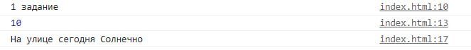
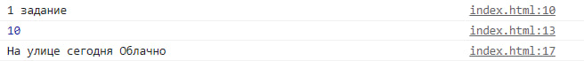
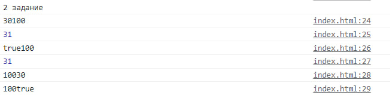
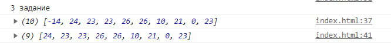
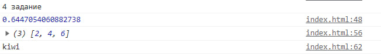
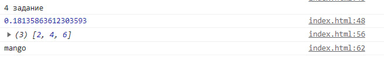
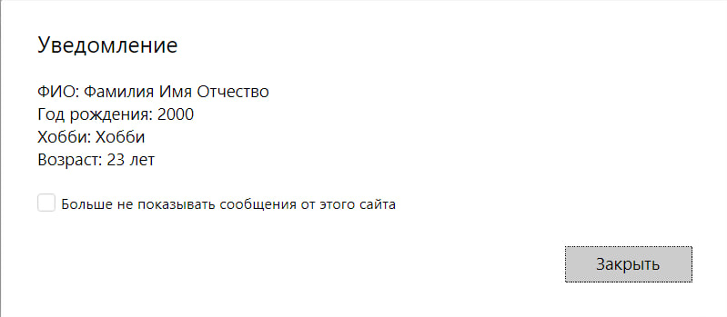
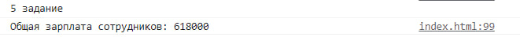

<h2>Лабораторная работа №6</h2>

### Задание 1
1. Нужно создать переменную `apple` со значением 10
~~~js
let apple = 10;
~~~
2. Вывести эту переменную с помощью операторов: `alert(); console.log();
```js
alert(apple);
console.log(apple);
```
3. Создать переменную `condition`, значение должно быть случайной строкой
```js
let possibleConditions = ["Солнечно", "Облачно", "Дождь", "Снег", "Туман"];
let randomIndex = Math.floor(Math.random() * possibleConditions.length);
let condition = possibleConditions[randomIndex];
console.log("На улице сегодня "+ condition);
```
4. Посмотреть, что будет при выполнении операции `console.log('Good game is ' + condition)`



### Вопросы
1. Через какой оператор Вы объявили переменую? - let
2. Какие доступны операторы для объявления переменных? В чём их отличия? - let, var. Отличия, на сколько я понял, в области видимости переменной, т.е. let объявляется как локальная, а var как глобальная
3. Что происходит при вызове `alert()`? - уведомление
4. Как Вы думаете для чего может использоваться `console.log()` - вывод информации в консоль
---

### Задание 2
1. Создать произвольную целочисленную переменную
```js
let int = 30;
```
2. Создать строковую переменную, которая будет со значением `'100'`
```js
let str = "100";
```
3. Создать произвольную булевую переменную
```js
let bool = true;
```
4. После этого сделать конкатенацию всех этих переменных, вывести в консоль каждую  

---
###  Задание З
1. Создать массив длинной 10 элементов
```js
let mas = [];
```
2. Заполнить этот массив рандомными числами с помощью оператора `for`
```js
for (let i = 0; i < 10; i++){
    let rand = Math.floor(Math.random() * 101) - 50;
    mas.push(rand);
}
```
3. Используя метод `filter` убрать из массива числа меньше 0
```js
let filtrMas = mas.filter(function(c){
    return c>=0;
});
```

---

### Задание 4

1. Создать функцию, которая будет возвращать случайное число.
Проверить работу функции и вывести в консоль
```js
function GetFirstRandom(){
    return Math.random();
}
```
2. Создать функцию, которая будет принимать массив в качестве
первого параметра, а в качестве второго параметра число.
Результатом функции будет массив полученный в результате
умножения второго параметра на каждый элемент массива, полученного в качестве первого параметра
```js
function MultiplyArray(mass, index){
    return mass.map(function(element){
        return element * index;
    });
}
```
3. Создать анонимную функцию которая будет генерировать случайное слово, вывести в консоль сгенерированное слово
```js
const generateRandomWord = () => {
    const words = ["apple", "banana", "cherry", "date", "grape", "kiwi", "lemon", "mango", "orange", "peach", "pear", "strawberry", "watermelon"];
    const randomIndex = Math.floor(Math.random() * words.length);
    return words[randomIndex];
};
```


---

### Задание 5 
1. Создать простой пустой объект
```js
let person = {};
```
2. Добавить поля: `firstName`, `surname`, `patronymic`, `birthday`, `hobby` и `group`
```js
person.firstName = "Имя";
person.surname = "Фамилия";
person.patronymic = "Отчество";
person.birthday = 2000;
person.hobby = "Хобби";
person.group = "Группа";
```
3. Добавить метод, который будет возвращать ФИО, год рождения, хобби и возраст
```js
person.getInfo = function() {
    return `ФИО: ${this.surname} ${this.firstName} ${this.patronymic}\nГод рождения: ${this.birthday}\nХобби: ${this.hobby}\nВозраст: ${2023-this.birthday} лет`;
};
```
4. Вызвать этот метод и вывести результат через `alert`
```js
alert(person.getInfo());
```
5. Создать объект, где будут храниться зарплаты 10 сотрудников по правилу: ключ - фамилия, а значение - зарплата
```js
let salaries = {
    "Сотрудник1": 50000,
    "Сотрудник2": 60000,
    "Сотрудник3": 55000,
    "Сотрудник4": 70000,
    "Сотрудник5": 75000,
    "Сотрудник6": 48000,
    "Сотрудник7": 67000,
    "Сотрудник8": 72000,
    "Сотрудник9": 58000,
    "Сотрудник10": 63000,
};
```
6. После этого необходимо посчитать общую зарплату сотрудников
```js
for (let employee in salaries) {
    totalSalary += salaries[employee];
}
```


---